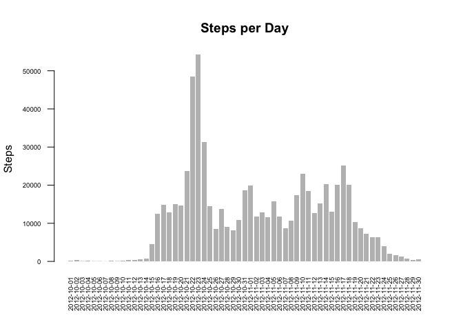

# Reproducible Research: Peer Assessment 1


## Loading and preprocessing the data

```r
fileurl <- "https://d396qusza40orc.cloudfront.net/repdata%2Fdata%2Factivity.zip"
datadir <- "./"
zipfile <- "activity.zip"
zipfilefullpath <- paste(datadir, "/", zipfile, sep="")
```

### Unzip the data file 

```r
unzip(zipfile = zipfilefullpath, exdir = datadir)
```

### Load Data

```r
if(!exists("ACT")){
  print("loading activity.csv")
  ACT <- read.csv("./activity.csv")
}else{
  print("activity.csv already loaded")
}
```

```
## [1] "loading activity.csv"
```

###Transform Data 

```r
ACT$date <- as.Date(ACT$date, format= "%Y-%m-%d")
rmna <- na.omit(ACT)
ACTSum <- aggregate(steps ~ date, data=rmna, FUN = sum)
```

### What is mean total number of steps taken per day?

```r
ACTSum <- aggregate(steps ~ date, data=rmna, FUN = sum)
barplot(ACTSum$steps, names.arg = ACTSum$date, main="Steps per Day",ylab="Steps",xlab="", cex.names= 0.6, cex.axis=0.6, las=2, border = NA)
```

<!-- -->

#### What is the mean of the total number of steps taken per day

```r
mean(ACTSum$steps)
```

```
## [1] 10766.19
```

#### What is the median of the total number of steps taken per day

```r
median(ACTSum$steps)
```

```
## [1] 10765
```

## What is the average daily activity pattern?

#### Make a time series plot


```r
ACTInt <- aggregate(steps ~ interval, data=rmna, FUN = mean)
plot(ACTInt$steps, main="Steps per Day",ylab="Steps",xlab="Intervals each day", type = "l")
```

<!-- -->


#### The 5-minute interval that contains the maximum number of steps

```r
which.max(ACTInt$steps)
```

```
## [1] 104
```

## Imputing missing values
#### Total number of NA Values 

```r
sum(is.na(ACT))
```

```
## [1] 2304
```

####Strategy for filling in all of the missing values in the dataset.

```r
ACTMerged <- merge(ACT, ACTInt, by="interval")
ACTMerged$steps.x[is.na(ACTMerged$steps.x)] <- ACTMerged$steps.y[is.na(ACTMerged$steps.x)]
```
####Create a new dataset that is equal to the original dataset but with the missing data filled in

```r
ACTNew <- ACT
ACTNew$steps <- round(ACTMerged$steps.x, digits = 2)
```

##### Histogram of the new data set with the dayly steps taken (Mean and Median)

```r
ACTNewSum <- aggregate(steps ~ date, data=ACTNew, FUN = sum)
barplot(ACTNewSum$steps, names.arg = ACTNewSum$date, main="Steps per Day",ylab="Steps",xlab="", cex.names= 0.6, cex.axis=0.6, las=2, border = NA)
```

<!-- -->

####Mean

```r
mean(ACTNewSum$steps)
```

```
## [1] 10766.18
```

####Median

```r
median(ACTNewSum$steps)
```

```
## [1] 10351.69
```

## Are there differences in activity patterns between weekdays and weekends?

###Create a new factor variable in the dataset with two levels -- "weekday" and "weekend" indicating whether a given date is a weekday or weekend day.


```r
ACT$dateType <-  as.factor(ifelse(as.POSIXlt(ACT$date)$wday %in% c(0,6), 'weekend', 'weekday'))
```

###Make a panel plot containing a time series plot of weekend and week


```r
Weekdata <- ACT[ACT$dateType == "weekday",]
Weekenddata <- ACT[ACT$dateType == "weekend",]

par(mfrow=c(2,1))
ACTWeek <- aggregate(steps ~ interval, data=Weekdata, FUN = mean)
plot(ACTWeek, main="Steps during the Week",ylab="Steps",xlab="Intervals during week", type = "l")

ACTWeekend <- aggregate(steps ~ interval, data=Weekenddata, FUN = mean)
plot(ACTWeekend, main="Steps during the Weekend",ylab="Steps",xlab="Intervals during weekend", type = "l")
```

<!-- -->

